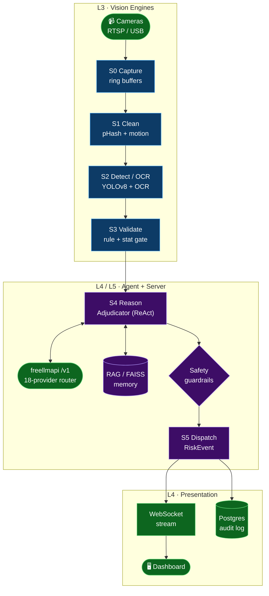
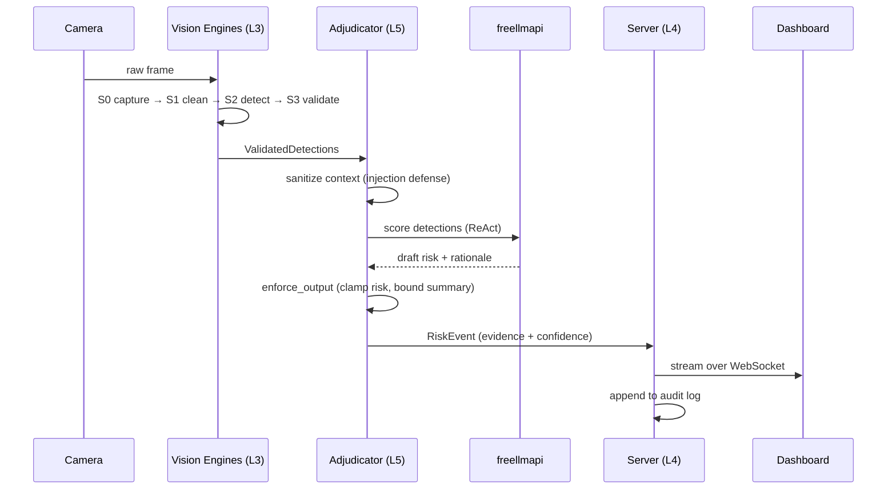

<div align="center">


# VIGIL

### Visual Intelligence Graph & Inference Layer

**A block-graph, real-time vision platform with a swappable free-tier LLM reasoning core.**

_Turn any camera stream into risk-scored, human-readable, auditable events — through a pipeline of small, inspectable decisions instead of one opaque model._

<br/>

[](./LICENSE)
[](./pyproject.toml)
[](./server)
[](./.github/workflows/ci.yml)
[](https://github.com/tashfeenahmed/freellmapi)
[](#-project-status)

</div>

---

## 📍 Table of Contents

- [What is VIGIL?](#-what-is-vigil)
- [Reference Lineage](#-reference-lineage-standing-on-four-shoulders)
- [The Five Layers](#-the-five-layers-univision-learning-map)
- [System Architecture](#-system-architecture)
- [The Pipeline (S0–S5)](#-the-pipeline-s0s5)
- [The AI Core (freellmapi)](#-the-ai-core-freellmapi)
- [Quickstart](#-quickstart)
- [Repository Layout](#-repository-layout)
- [Safety Model](#-safety-model-non-negotiable)
- [Project Status](#-project-status)
- [License & Attribution](#-license--attribution)

---

## 🧭 What is VIGIL?

VIGIL runs a live camera feed through a **validated block-graph** — `capture → clean → detect → validate → reason → report → store` — emitting a bounded, evidence-carrying `RiskEvent` at the end of every cycle.

The design philosophy is deliberate:

> **Not one big model. A pipeline of small, inspectable, swappable decisions.**

Each stage is a typed **Block** with declared input/output **ports**, wired into a **directed acyclic graph (DAG)** that is validated *before* it ever runs. The reasoning layer is provider-agnostic: VIGIL speaks to a single OpenAI-compatible `/v1` endpoint, so you can swap **Groq → Gemini → a local vLLM** without touching a line of VIGIL code.

---

## 🧬 Reference Lineage: Standing on Four Shoulders

VIGIL is a **synthesis** — it borrows one hard-won idea from each of four production-grade open-source projects and fuses them into a single coherent stack. The concept cards below link to each upstream repository.

<table>
  <tr>
    <td width="50%" valign="top">
      <a href="https://github.com/roboflow/inference">
        
      </a>
      <p><b>What VIGIL borrows:</b> the <i>Visual Workflow</i> editor, model-chaining <b>blocks</b>, and the live-video <code>InferencePipeline</code> abstraction — the idea that CV should be composed, not coded.</p>
    </td>
    <td width="50%" valign="top">
      <a href="https://github.com/pysource-com/VisoNode">
        
      </a>
      <p><b>What VIGIL borrows:</b> the <i>no-code node graph</i> UX — wire a <b>camera → YOLO → live output</b> visually, with zero boilerplate, so a graph is something you <i>draw</i>.</p>
    </td>
  </tr>
  <tr>
    <td width="50%" valign="top">
      <a href="https://github.com/SharpAI/DeepCamera">
        
      </a>
      <p><b>What VIGIL borrows:</b> <i>local VLM analysis</i> + <b>agentic camera reasoning</b> + alerting on the edge — the notion that a camera can <i>reason</i>, not just detect.</p>
    </td>
    <td width="50%" valign="top">
      <a href="https://github.com/GetStream/Vision-Agents">
        
      </a>
      <p><b>What VIGIL borrows:</b> the clean <b>detector ↔ reasoning-LLM split</b> inside a low-latency processor pipeline — fast perception, slow deliberation, cleanly separated.</p>
    </td>
  </tr>
</table>

> ℹ️ **Attribution:** These upstream projects are independent works by their respective authors under their own licenses. VIGIL re-implements *concepts and interfaces* for learning purposes; it vendors none of their code.

---

## 📚 The Five Layers (UniVision Learning Map)

VIGIL is structured as five stacked layers. Each maps 1:1 to a directory and to a rung on the UniVision learning ladder — read the codebase bottom-up and you learn the whole stack.

| Layer | Domain | Responsibility | Lives in |
|:-----:|--------|----------------|----------|
| **L1** | Computational core | Variables, logic, state, block/registry primitives, pipelines | `core/` |
| **L2** | Visual programming | Blocks, ports, connections, DAG validation, execution order | `core/graph/` |
| **L3** | Computer vision | Frames, preprocessing, YOLO detection, OCR, tracking, anomaly | `engines/` |
| **L4** | Full-stack | FastAPI, WebSocket streaming, dashboard, queue, storage, metrics | `server/`, `frontend/` |
| **L5** | Agentic AI | LLM tools, ReAct adjudication, RAG/FAISS, safety & human oversight | `agent/` |

---

## 🏗️ System Architecture



> The graph is **validated before execution**: every edge is a typed port contract, so a malformed pipeline fails at build time — never mid-stream on a live camera.

---

## 🔁 The Pipeline (S0–S5)

One pass over a single frame, end to end:



| Stage | Block | Guarantee |
|:-----:|-------|-----------|
| **S0** | `CaptureBlock` | Monotonic frame index; deterministic stub when no camera |
| **S1** | `CleanBlock` | Normalized geometry + color space for inference |
| **S2** | `DetectBlock` | Empty-but-valid output when no detector backend is present |
| **S3** | `ValidateBlock` | Drops low-confidence / malformed boxes; reports `dropped` count |
| **S4** | `Adjudicator` | Provider-agnostic reasoning with heuristic fallback |
| **S5** | Dispatch | Bounded `RiskEvent` — `0.0 ≤ risk ≤ 1.0`, summary ≤ 280 chars |

---

## 🧠 The AI Core (freellmapi)

VIGIL **never hardcodes a model.** It calls one OpenAI-compatible endpoint served by [**freellmapi**](https://github.com/tashfeenahmed/freellmapi), which stacks the free tiers of **18 LLM providers** behind a single bearer token.

- **Base URL:** `http://freellmapi:8080/v1` — one endpoint for chat, embeddings, audio and images
- **Smart routing:** highest-priority *healthy, in-budget* model; sticky sessions for 30 min
- **Automatic failover:** transparent `429`/`5xx` fallback across the chain; embeddings failover locked to the same vector dimension
- **One integration point:** Adjudicator, OCR post-reasoning, and RAG all speak to this single endpoint

```yaml
# config/llm.yaml (illustrative)
base_url: http://freellmapi:8080/v1
token: ${VIGIL_LLM_TOKEN}   # freellmapi-...
routing: priority-healthy-in-budget
sticky_session_minutes: 30
```

---

## 🚀 Quickstart

```bash
# 1. Configure
cp .env.example .env          # set VIGIL_LLM_TOKEN=freellmapi-...

# 2. Bring the stack up
docker compose up -d          # api :8000 · web :5173 · freellmapi :8080 · grafana :3000

# 3. Validate every block + example DAG
python tools/validate.py

# 4. Open the dashboard — drag blocks, wire a graph, hit Run
open http://localhost:5173
```

Run a workflow **headless**:

```bash
curl -X POST localhost:8000/v1/analyze \
  -H "Content-Type: application/json" \
  -d '{"workflow":"perimeter_safety","source":"rtsp://cam-1/stream"}'
```

Local development (no Docker):

```bash
python -m venv .venv && source .venv/bin/activate
pip install -e ".[dev]"
pytest -q                                         # run the test suite
uvicorn server.app:create_app --factory --reload  # serve the API
```

---

## 📂 Repository Layout

```text
vigil/
├─ core/          # L1  computational core: blocks, registry, state
│  └─ graph/      # L2  DAG wiring, port contracts, executor
├─ engines/       # L3  vision: capture · clean · detect · validate + shared types
├─ agent/         # L5  freellmapi client · adjudicator · safety · rag · tools
├─ server/        # L4  FastAPI app · routes · schemas · WebSocket · metrics
├─ frontend/      # L4  dashboard: index.html · styles.css · app.js
├─ config/        # settings + pipeline.yaml (declarative S0–S3 DAG)
├─ tests/         # pytest suites (test_engines, test_agent, ...)
├─ .github/       # CI: pytest matrix + ruff lint
├─ ARCHITECTURE.md CONTRIBUTING.md docker-compose.yml pyproject.toml Makefile
└─ README.md
```

---

## 🛡️ Safety Model (Non-Negotiable)

The agent tool layer is treated as an **untrusted boundary in, bounded contract out**:

- **Evidence-first:** every AI event carries evidence, timestamp, source and confidence.
- **Human-in-the-loop:** high-stakes actions require explicit human approval.
- **Injection defense:** free text reaching the reasoning core passes through `agent.safety.sanitize_text`.
- **Output contract:** model output passes `enforce_output` — risk clamped to `[0,1]`, summary bounded, label defaulted.
- **Auditability:** an append-only audit log guards the tool layer.

---

## 📊 Project Status

> **Concept reference repository.** Interfaces, stubs and the five-layer architecture are complete and validated; model weights and provider keys are user-supplied. Every block runs a deterministic stub path so the graph stays importable, testable, and GPU-free out of the box.

---

## 📜 License & Attribution

VIGIL is released under the **[Apache-2.0](./LICENSE)** license.

It is an educational synthesis inspired by — and crediting — four upstream projects:
[roboflow/inference](https://github.com/roboflow/inference) · [pysource-com/VisoNode](https://github.com/pysource-com/VisoNode) · [SharpAI/DeepCamera](https://github.com/SharpAI/DeepCamera) · [GetStream/Vision-Agents](https://github.com/GetStream/Vision-Agents) — with reasoning powered by [tashfeenahmed/freellmapi](https://github.com/tashfeenahmed/freellmapi). All trademarks and code belong to their respective owners.

<div align="center">
<sub>Built as a layered learning map · read it bottom-up (L1 → L5) and you learn the whole stack.</sub>
</div>
